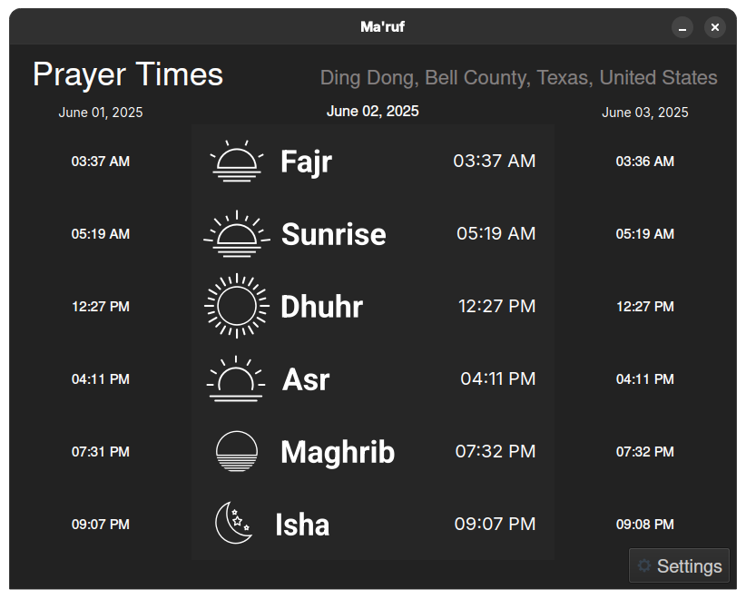
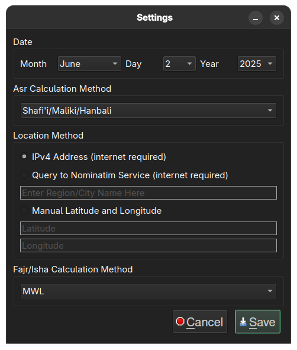

    
    <h1 align="center">Ma'ruf</h1>

## Description
Ma'ruf is a fast, privacy-friendly and cross-platform desktop application for calculating daily Islamic prayer times locally on your device. Built with PyQt6/PySide6 and precise astronomical algorithms, no internet connection required.

## Screenshots

   
  <em>Figure: Main Interface</em>

&nbsp;&nbsp;

   
  <em>Figure: Settings Interface</em>

## TODOs
- Add UTC Offset change option
- Change UTC Offset when changing location based on coordinates
- Include fonts maybe or have better system font defaults for windows

## Credits
- Would not be possible without the information provided by [Radhi Fadlillah](https://radhifadlillah.com/) and [prayertimes.org](https://www.prayertimes.org/en/prayer-times-calculation-methodology/)
- [NOAA Solar Calculator](https://gml.noaa.gov/grad/solcalc/)
- [PrayTimes.org](https://praytimes.org/manual)
