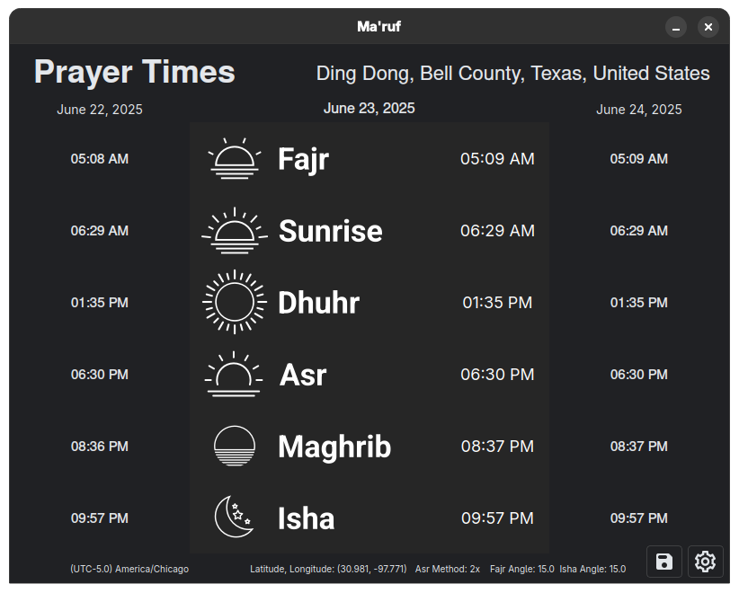
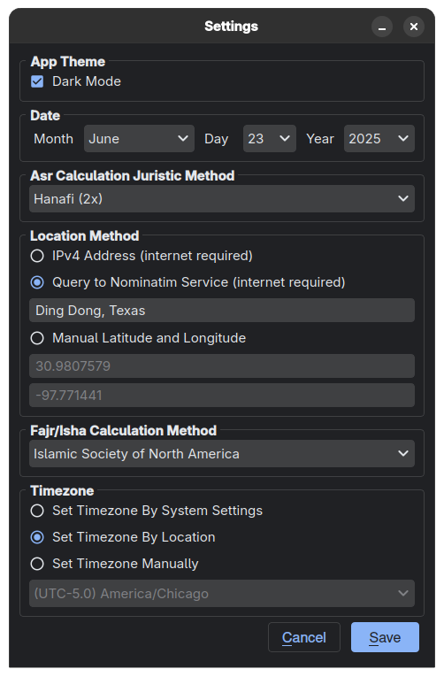

<p align="center">
    
    <h1 align="center">Ma'ruf</h1>
</p>

## Description
Ma'ruf is a fast, privacy-friendly and cross-platform desktop application for calculating daily Islamic prayer times locally on your device using the `maruf` python module. Built with PyQt6/PySide6 and precise astronomical algorithms, no internet connection required.

## Screenshots
<p align="center">
  <br>
  <em>Figure: Main Interface</em>
</p>
&nbsp;&nbsp;
<p align="center">
  <br>
  <em>Figure: Settings Interface</em>
</p>

## Features
- Flexible Location Detection
    - Automatically determines location using:
        - Manual coordinate entry
        - Address or place name search via the Nominatim API
        - IPv4-based geolocation if internet available (no user input required)
- Accurate Timezone Handling
    - On-device timezone lookup using `timezonefinder`, no internet required
    - Option to use the system timezone
    - Manual timezone override
- Global Calculation Methods Supported
    - Supports widely used prayer time calculations methods including:
        - Muslim World League (MWL)
        - Islamic Society of North America (ISNA)
        - Umm al-Qura University (Makkah)
        - and many more...
- TOML-Based Configuration
    - Settings including location, timezone method, asr method, and calculation method, can be easily customized via a human-readable `config.toml`. This allows:
        - Portability and easy sharing of settings
        - Offline and script-friendly setup

## *How does it work?*
- Ma'ruf uses an adaptation of Jean Meeus' Astronomical Algorithms in order to calculate sun position and takes into account irregularities in Earth, such as eccentricity and refraction.
- On first launch, Ma'ruf looks for the existence of a `config.toml` file in its directory (`./config.toml`), checks its validity, and loads from this file, if it does not find this file it will check for internet and use the `ip-api` to get location coordinates from the device's IP address.
- In the case that there is not internet connectivity, or a very slow response from Cloudflare servers, it will use the defaults of Phoenix, Arizona, United States.
- The first launch will usually be slower because of the network requests being made, as well as querying the fairly large, included `timezonefinderl` database, but subsequent launches with the configuration file existing will be much faster.

## Installation on Linux
### Run Source Code
#### Prerequisites
```
git
python3-pip
python3>=3.11
```
#### Installing `python-pip` requirements
```bash
git clone https://github.com/SheptheSheep1/prayer_times_app.git ./prayer_times_app
cd ./prayer_times_app
python3 -m venv venv
source venv/bin/activate # for POSIX-compatible shell (e.g. bash(mostly))
pip install -r requirements.txt
```
#### Running
```bash
python3 maruf.py
```

## Using python module `app.py`
#### Prerequisites
```python
geopy.geocoders
certifi
```
- The python module uses the `CalcMethod` class from the `CalcMethods.py` file for storing calculations methods, so this is a prerequisite as well
### Python
#### Usage
```python
from CalcMethods import CalcMethod
from app import PrayerTime, Location
# PrayerTime(month: int, day: int, year: int, utc_offset: float, calc_method: CalcMethod, asr_method: int, loc_desc: str, latitude: float, longitude: float, )
prayerTime = PrayerTime(7, 3, 2025, -6.0, CalcMethod(), 1, "Ding Dong, Texas, US", 30.974632, -97.777298)
prayerTime.putPrayerTimes()
print(prayerTime)
```
```
fajr: 2025-07-03 03:54:44
sunrise: 2025-07-03 05:33:10
dhuhr: 2025-07-03 12:37:26
asr: 2025-07-03 16:15:27
maghrib: 2025-07-03 19:37:42
isha: 2025-07-03 21:09:53
```
### CLI
#### Usage
```bash
$ python3 app.py -h
```
```
usage: Ma'ruf [-h] [-b] [-v] [-lat LATITUDE] [-lng LONGITUDE]

Calculates islamic prayer times using on-device calculations exclusively

options:
  -h, --help            show this help message and exit
  -b, --headless
  -v, --verbose
  -lat, --latitude LATITUDE
                        input latitude coordinate
  -lng, --longitude LONGITUDE
                        input longitude coordinate

Visit <https://github.com/SheptheSheep1/prayer_times_app> for more info and documentation.
```

## TODOs
- [x] Add UTC Offset change option
- [x] Change UTC Offset when changing location based on coordinates
- [ ] Include fonts maybe or have better system font defaults for windows
- [ ] Implement changing time/date display format through `strftime()`
- [x] Query character limits/regex
- [x] Add timeout to ip and query threads when loading and exception handling if request doesn't work
- [x] Set character limits on region widget
- [x] Handling system color or set actual dark mode
- [ ] Custom Calculation Method for fajr and isha
- [x] Implement TOML persistent config
- [x] Handle no rw or w access in directory
- [x] Handle `None` being returned by `get_offset_name()` in `pray_data` or use Exceptions
- [ ] Handle error in loading config
- [x] Add splashscreen and threading/processes to handle initial config
- [ ] Add option for reverse geocoding of manual coordinates
- [ ] High Altitude Correction (more than 48.5 degrees N or S)
- [ ] Integration of default config locations like `%APPDATA%` and `~/.local/share...` or `/usr/share/...`
- [ ] Hijri Date w/ user adjustments using saudi standard (or other)

## Credits
- Would not be possible without the information provided by [Radhi Fadlillah](https://radhifadlillah.com/) and [prayertimes.org](https://www.prayertimes.org/en/prayer-times-calculation-methodology/)
- [NOAA Solar Calculator](https://gml.noaa.gov/grad/solcalc/)
- [PrayTimes.org](https://praytimes.org/manual)
- [Astronomical Algorithms - Jean Meeus (1991)](https://archive.org/details/astronomicalalgorithmsjeanmeeus1991)
